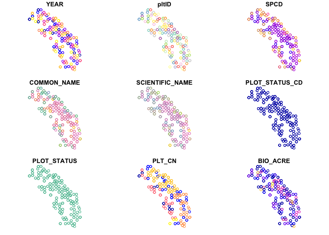
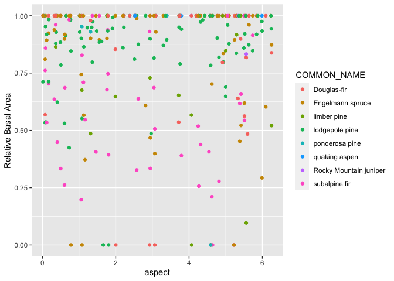
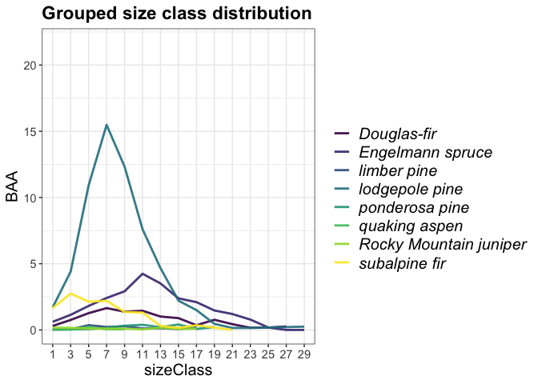

bighorn\_trees
================

## Download forest boundary

``` r
# download from https://data.fs.usda.gov/geodata/edw/datasets.php?dsetCategory=boundaries
nf=read_sf("data/S_USA.AdministrativeForest/S_USA.AdministrativeForest.shp")
bighorn=dplyr::filter(nf,FORESTNAME=="Bighorn National Forest") 
```

## Download elevation data

``` r
library(rasterVis)
```

    ## Loading required package: raster

    ## Loading required package: sp

    ## 
    ## Attaching package: 'raster'

    ## The following object is masked from 'package:dplyr':
    ## 
    ##     select

    ## The following object is masked from 'package:tidyr':
    ## 
    ##     extract

    ## The following object is masked from 'package:rFIA':
    ## 
    ##     area

    ## Loading required package: terra

    ## terra version 1.3.4

    ## 
    ## Attaching package: 'terra'

    ## The following object is masked from 'package:dplyr':
    ## 
    ##     src

    ## Loading required package: lattice

    ## Loading required package: latticeExtra

    ## 
    ## Attaching package: 'latticeExtra'

    ## The following object is masked from 'package:ggplot2':
    ## 
    ##     layer

``` r
centroid=st_coordinates(st_centroid(bighorn))
```

    ## Warning in st_centroid.sf(bighorn): st_centroid assumes attributes are constant
    ## over geometries of x

``` r
dem=getData(name="SRTM",lat=centroid[2],lon=centroid[1],path="data") %>% 
  crop(bighorn) %>% 
  mask(bighorn)
names(dem)="dem"

tpi=terrain(dem,opt="TPI")
slope=terrain(dem,opt="slope")
aspect=terrain(dem,opt="aspect")

terrain=stack(dem,slope,aspect,tpi)

plot(terrain)
```

<!-- -->

## Download FIA data

``` r
# run once
#fia=getFIA(states = c('WY'),dir = 'data/',load=F)

fia_all=readFIA(states = c('WY'),dir = 'data/')

fia <- clipFIA(fia_all, mostRecent = F, mask = bighorn)
```

## Map of FIA plots within the boundary

``` r
gplot(dem)+
  geom_raster(aes(fill=value))+
  geom_sf(data=bighorn,inherit.aes = F,fill="transparent",col="red")+
  geom_point(data=fia$PLOT,
             mapping=aes(y=LAT,x=LON),inherit.aes = F)
```

<!-- -->

``` r
## Spatial plots with biomass 
bio_pltSF <- biomass(fia, byPlot = TRUE, bySpecies = TRUE, returnSpatial = TRUE)

tpa_pltSF <- tpa(fia, byPlot = TRUE, bySpecies = TRUE, returnSpatial = TRUE)
```

``` r
## Plot the results using default sf method
plot(bio_pltSF)
```

    ## Warning: plotting the first 9 out of 11 attributes; use max.plot = 11 to plot
    ## all

<!-- -->

## Extract terrain variables for each plot

``` r
env=extract(terrain, tpa_pltSF)
tpa = bind_cols(tpa_pltSF,as.data.frame(env))
```

### Relative basal area along an environmental gradient

``` r
ggplot(tpa,aes(y=BAA_PERC,x=aspect,col=COMMON_NAME))+
  geom_point()+
  ylab("Relative Basal Area")
```

    ## Warning: Removed 4 rows containing missing values (geom_point).

<!-- -->

## Group estimates by species

``` r
fia_species <- tpa(fia, bySpecies = TRUE)

## Group by species and size class, and plot the distribution 
fia_spsc <- tpa(fia, bySpecies = TRUE, bySizeClass = TRUE)

## Grouped time series by ownership class
plotFIA(fia_spsc, y = BAA, grp = COMMON_NAME, 
        x = sizeClass, n.max = 25, 
        plot.title = 'Grouped size class distribution')
```

<!-- -->
