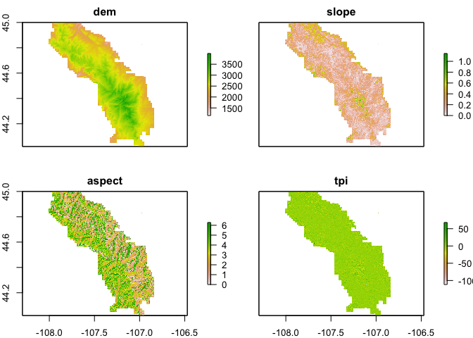

bighorn\_trees
================

``` r
nf=read_sf("data/S_USA.AdministrativeForest/S_USA.AdministrativeForest.shp")
bighorn=dplyr::filter(nf,FORESTNAME=="Bighorn National Forest") 

# run once
#fia=getFIA(states = c('WY'),dir = 'data/',load=F)

fia_all=readFIA(states = c('WY'),dir = 'data/')

fia <- clipFIA(fia_all, mostRecent = F, mask = bighorn)
```

``` r
ggplot(bighorn[1])+
  geom_sf()+
  geom_point(data=fia$PLOT,
             mapping=aes(y=LAT,x=LON),inherit.aes = F)
```

<!-- -->

``` r
## Spatial plots with biomass 
bio_pltSF <- biomass(fia, byPlot = TRUE, returnSpatial = TRUE)
```

``` r
## Plot the results using default sf method
plot(bio_pltSF)
```

<!-- -->

``` r
## Group estimates by species
fia_species <- tpa(fia, bySpecies = TRUE)

## Group by species and size class, and plot the distribution 
fia_spsc <- tpa(fia, bySpecies = TRUE, bySizeClass = TRUE)

## Grouped time series by ownership class
plotFIA(fia_spsc, y = BAA, grp = COMMON_NAME, 
        x = sizeClass, n.max = 25, 
        plot.title = 'Grouped size class distribution')
```

<!-- -->
